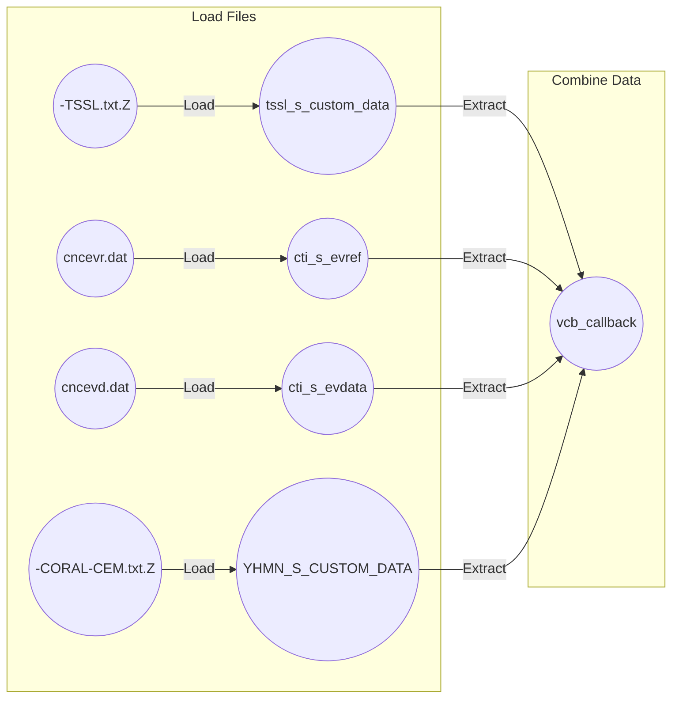

# vader_Exp19

```mermaid
flowchart LR  
  
subgraph Load Files  
  A((<YYYYMMDDHH24MI>-TSSL.txt.Z)) -->|Load| B((tssl_s_custom_data))  
  C((cncevr<DDMMYYYY>.dat)) -->|Load| D((cti_s_evref))  
  E((cncevd<DDMMYYYY>.dat)) -->|Load| F((cti_s_evdata))  
  G((<YYYYMMDDHH24MI>-CORAL-CEM.txt.Z)) -->|Load| H((YHMN_S_CUSTOM_DATA))  
end  
  
subgraph Combine Data  
  B -->|Extract| I((vcb_callback))  
  D -->|Extract| I  
  F -->|Extract| I  
  H -->|Extract| I  
end  

```
